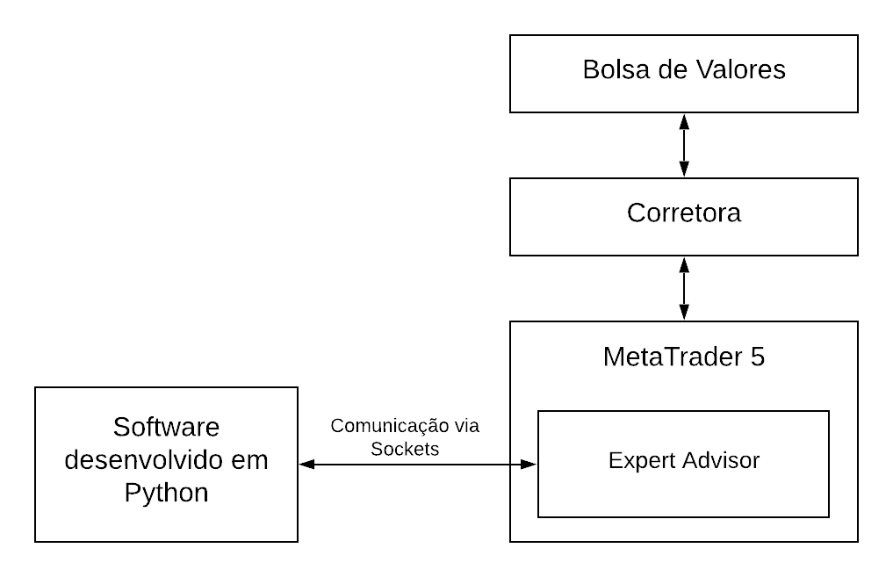

# Sistema Automatizado para Operação na Bolsa de Valores

## Arquitetura
A arquitetura proposta é baseada em um sistema de filas assíncronas e é apresentada a seguir.

**MAD** - Módulo de aquisição de dados: responsável por obter os dados do Metatrader.

**ROT 1 .. N** : rotinas de processamento de dados.

**MET** -  Módulo de execução de tarefas: responsável por executar as tarefas agendadas pelas rotinas de processamento.

## Classes

**Sniffer**: implementa as rotinas básicas do Metatrader

**BaseConsumer**: implementa a classe-base(superclasse) com as funcionalidades básicas das rotinas de processamento de dados.
