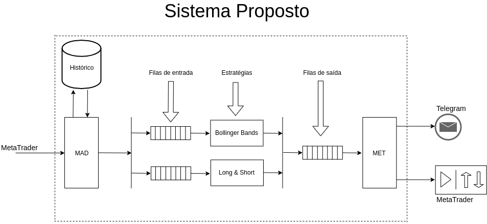

# Sistema Automatizado para Operação na Bolsa de Valores

## Objetivo
Este projeto tem como objetivo:
1- Aprimorar estratégias de operação na bolsa de valores baseadas em análise técnica por meio de otimização de parâmetros a partir de backtesting.
2- Automatizar operações em tempo real utlizando o MetaTrader e Bot no Telegram para monitoramento.

## Arquitetura
A arquitetura proposta é baseada em um sistema que consome dados do banco contendo valores históricos, assim como coleta dados em tempo real pelo MetaTrader e, após um tratamento, estes dados são enviados por meio de filas assíncronas que são consumidas pelos módulos que representam as estratégias.

**MAD** - Módulo de aquisição de dados: responsável por obter os dados do Metatrader.

**ROT 1 .. N** : rotinas de processamento de dados.

**MET** -  Módulo de execução de tarefas: responsável por executar as tarefas agendadas pelas rotinas de processamento.

## Classes

**Sniffer**: implementa as rotinas básicas do Metatrader

**BaseConsumer**: implementa a classe-base(superclasse) com as funcionalidades básicas das rotinas de processamento de dados.
